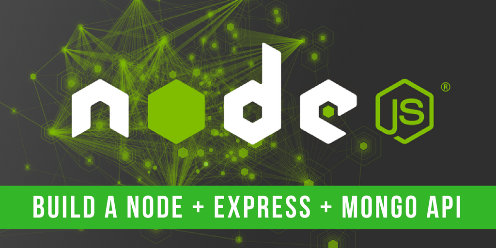

# Build NodeJS APIs
Hello Everyone, :bamboo: this is a repository for learning build APIs using (nodejs, express &amp; mongodb). 

# [Documentations](./docs/main.md)
On this the [documentations](./docs/main.md) you can find details how to build APIs using (NEM) and on the documentations will be explain step by step build APIs from the scracth. 

References :
[MongoDB NodeJS Driver](http://mongodb.github.io/node-mongodb-native/),
[Installing mongoDB](https://docs.mongodb.com/v3.0/tutorial/install-mongodb-on-windows/),
[Mongo Lab](https://mlab.com/),
[Medium](https://medium.freecodecamp.org/building-a-simple-node-js-api-in-under-30-minutes-a07ea9e390d2).

Thank you.